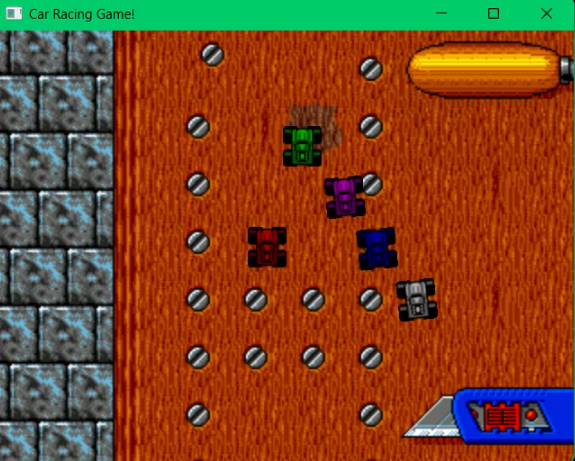
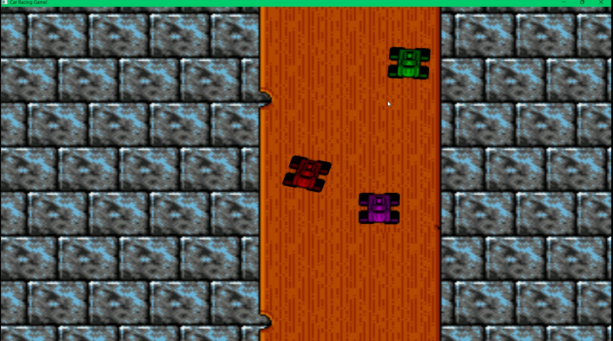
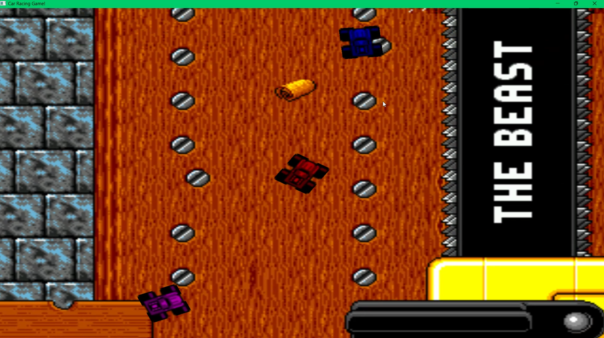

---
## Car Racing Game

### Description
This Car Racing Game is developed using the SFML library in C++. It features an endless racing mode where the player competes against four AI-controlled cars (bots). The game provides an engaging and dynamic racing experience with smooth graphics and realistic car movements.

### How to Run
1. **Clone the Repository**:
   - Clone this repository to your local machine using the following command:
     ```bash
     git clone https://github.com/P1Manav/Car-Racing-Game.git
     ```
2. **Setup Visual Studio**:
   - Make sure you have Visual Studio installed. You can download it from [here](https://visualstudio.microsoft.com/downloads/).
   - Open Visual Studio and Clone a new repository direct or open the .sin file from the project directory.

3. **Open the Project**:
   - Open the `.sln` file in Visual Studio to load the project.

4. **Build the Project**:
   - Set the configuration to `x86`.
   - Build the project by clicking on `Build` > `Build Solution` or pressing `Ctrl+Shift+B`.

5. **Run the Game**:
   - Run the game by clicking on `Debug` > `Start Without Debugging` or pressing `Ctrl+F5`.

### How to Play
- **Player Controls**:
  - Use the arrow keys to control your car:
    - `↑` (Up Arrow): Accelerate
    - `↓` (Down Arrow): Brake/Reverse
    - `←` (Left Arrow): Turn left
    - `→` (Right Arrow): Turn right

- **Objective**:
  - The objective of the game is to navigate your car through a map . As you race, you will compete against four AI-controlled cars (bots) that are also trying to win.

- **Game Dynamics**:
  - Your car's speed and angle are controlled by the arrow keys. The car accelerates forward when the up arrow is pressed and decelerates when the down arrow is pressed. Turning left and right adjusts the car's angle based on its current speed.
  - The game uses realistic physics for car movements, adding to the challenge and excitement of the race.

- **AI Behavior**:
  - The four AI-controlled cars will autonomously navigate the track, aiming to reach the same checkpoints as the player. Their paths are influenced by their current speed and angle, making them formidable opponents.

- **Endless Gameplay**:
  - The game features an endless mode where the race continues indefinitely. The goal is to see how long you can keep up with the bots .

### Screenshots


---

<p align="center">
  
</p>
<p align="center">
  
</p>
<p align="center">
  
</p>
